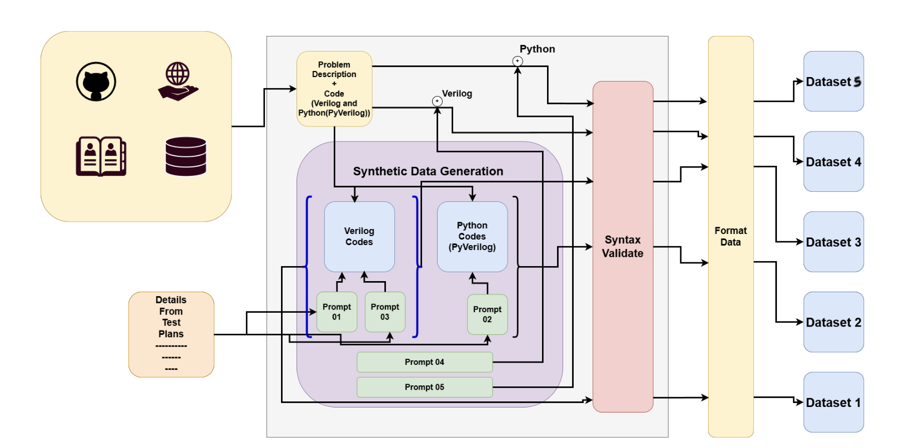
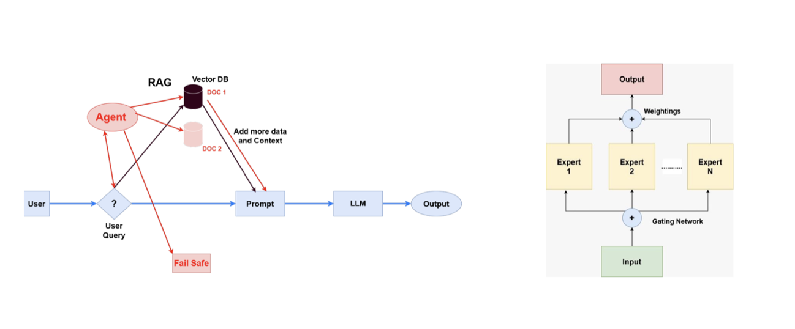

[comment]: # "This is the standard layout for the project, but you can clean this and use your own template"

# Verilog Code Generation with Variations Using Fine-Tuned Large Language Models

#### Team

- E/19/205, Sahan Nimantha, [email](mailto:e19205eng.pdn.ac.lk)
- E/19/210, Jaliya Kumarasiri, [email](mailto:e19210@eng.pdn.ac.lk)
- E/19/455, Vidura Yashan, [email](mailto:e19455@eng.pdn.ac.lk)

#### Supervisors

- Dr. Isuru Nawinne, [email](mailto:isurunawinne@eng.pdn.ac.lk)
- Prof. Roshan G. Ragel, [email](mailto:roshanr@eng.pdn.ac.lk)
- Dr. Damayanthi Herath, [email](mailto:damayanthiherath@eng.pdn.ac.lk)

#### Table of content

1. [Abstract](#abstract)
2. [Related works](#related-works)
3. [Methodology](#methodology)
4. [Experiment Setup and Implementation](#experiment-setup-and-implementation)
5. [Results and Analysis](#results-and-analysis)
6. [Conclusion](#conclusion)
7. [Publications](#publications)
8. [Links](#links)

---

<!-- 
DELETE THIS SAMPLE before publishing to GitHub Pages !!!
This is a sample image, to show how to add images to your page. To learn more options, please refer [this](https://projects.ce.pdn.ac.lk/docs/faq/how-to-add-an-image/)
 
-->

## Abstract

The increasing complexity of modern hardware systems necessitates more efficient verification
processes to ensure functional correctness. Traditional test case generation for Verilog designs is
manual, time-consuming, and prone to human error, making automation essential. This project
aims to automate Verilog code variation generation to enhance hardware design verification,
leveraging Large Language Models (LLMs) and structured transformation techniques. The first phase involves identifying the most effective open-source LLMs from available
literature, which can surpass the state-of-the-art model performances in recognized benchmarks.
The selected models will then be used to generate Verilog code variations through three
structured approaches: (1) Python-based transformations, where variations are applied to a
Python implementation that can be converted to Verilog using PyVerilog and output the Python
implementation with the variations, and (2) Direct Verilog transformations, where modifications
are applied directly to Verilog code and output the Verilog code with the variations. (3) Generate
X-Form functions, which are Python scripts that can be transformed based on Verilog
implementations using variations described as a Python script using an object module; the best-
performing approach will be selected as the final deliverable. If the chosen model fails to generate syntactically and functionally correct variations, an
additional phase will be conducted to improve Verilog code generation from natural language
problem descriptions. This will involve dataset preparation and model fine-tuning to generate
both Verilog and Python (Pyverilog) implementations, and then again fine-tuning models to
generate variations. The implementation involves dataset construction, LLM fine-tuning (Supervised Fine-Tuning),
and evaluation against predefined correctness metrics. The final deliverable will be a fine-tuned
LLM that can be used to automate the Verilog variation generation using the most effective
approach. This system aims to significantly reduce manual effort and errors in hardware design
verification, improving efficiency in Electronic Design Automation (EDA) workflows.

## Related works

The rising complexity of modern computer hard-
ware has significantly increased the challenges in hardware
design. As a result, there is a growing demand for automating
various aspects of hardware development, including design veri-
fication. A broader range of test cases is essential to ensure com-
prehensive coverage of different functional branches in computer
hardware designs, minimizing the risk of carrying various un-
detected errors from the design phase to the subsequent phases.
Some companies in the industry have systems for generating
multiple test cases from a single test case for Verilog designs using
Verilog code variations. However, this process needs significant
manual intervention, making it time- and resource-intensive
and prone to human errors, making it increasingly important
to automate this process. Given the rapid advancements in
Large Language Models (LLMs) and generative AI, leveraging
LLMs for Verilog code variation generation presents a promising
solution to address this challenge. While currently, LLMs show
promising success in code generation across high-level program-
ming languages such as Python, Java, and C++, their application
in hardware description languages (HDLs) like Verilog, VHDL,
and Chisel remains challenging yet due to the fundamental
differences between software programming and hardware design.
While recent research has explored improving the accuracy
of Verilog generation from natural language descriptions, an
underexplored but critical area is the generation of Verilog
code variations, which is the key requirement of this research.

## Methodology

Our methodology is structured around automating the generation of Verilog code variations using Large Language Models (LLMs) through a pipeline of model evaluation, dataset construction, fine-tuning, and validation. The process is designed to identify the most effective technique among three key approaches: PyVerilog-based transformations, direct Verilog transformations, and X-Form-based adaptation.

### 1. Model Evaluation

Initially, we benchmark existing LLMs (e.g., GPT, CodeGen, DeepSeek) to assess their ability to generate functional and syntactically correct Verilog code and its variations. This evaluation identifies potential candidates for fine-tuning and helps understand existing gaps in Verilog variation generation.

### 2. Dataset Construction

We prepare five distinct datasets to support various transformation techniques:
- **Dataset 1**: Verilog base code + variation description → varied Verilog code.  
- **Dataset 2**: Python (PyVerilog) base code + variation description → varied code implementation in Python.  
- **Dataset 3**: Verilog base code + variation description → X-Form function (in Python).  
- **Dataset 4**: Hardware description → Verilog code (for training basic code generation).  
- **Dataset 5**: Hardware description → Verilog design in Python (PyVerilog).

### 3. Data Preprocessing

The data undergoes a two-phase preprocessing pipeline:

- **Stage 1**: Syntax validation (**VCS**, **SpyGlass**), duplicate removal (**MinHash**, **Jaccard**), tokenization and parsing.  
- **Stage 2**: Aligning Verilog/Python base codes with their variations and formatting for llm-fine-tuning.

### 4. Model Adaptation Approaches

**a) PyVerilog-Based Adaptation**

Uses Python as an intermediate representation with Verilog generated via PyVerilog. Incorporates:
- **Parameter-Efficient Fine-Tuning (PEFT)** methods: LoRA, QLoRA, Adapters.  
- **Agentic Retrieval-Augmented Generation (RAG)** system to enhance context understanding.  
- **Mixture of Experts (MoE)** to specialize in different types of variations.

**b) Direct Verilog-Based Adaptation**

Directly fine-tunes LLMs on Verilog code and variation tasks without relying on Python transformations. Utilizes **MoE architecture** to specialize in structural/functional categories of variations. Also using all three mentioned fine-tuning techniques.

**c) X-Form-Based Adaptation**

Trains LLMs to generate Python-based transformation functions (**X-Forms**) for producing Verilog code variations. This approach is more structured but limited by available X-Form templates. (Using same fine-tuning techniques)

### 5. Model Evaluation

We evaluate models using:

- **Benchmarks**: *VerilogEval* (Verilog-specific), *HumanEval* (general Python code generation).  
- **Metrics**: *Pass@k* (for top-k accuracy), *test case pass rate* (functional correctness), and *hardware compatibility*.

## Results and Analysis

The section will be updated in the future as the implementation progresses and evaluation outcomes become available.

## Conclusion

The section will be updated upon the completion of the implementation and evaluation phases to reflect the final insights and outcomes of the project.

## Publications

The section will be updated in the future as related research papers and reports are finalized and published.

[//]: # "Note: Uncomment each once you uploaded the files to the repository"

<!-- 1. [Semester 7 report](./) -->
<!-- 2. [Semester 7 slides](./) -->
<!-- 3. [Semester 8 report](./) -->
<!-- 4. [Semester 8 slides](./) -->
<!-- 5. Author 1, Author 2 and Author 3 "Research paper title" (2021). [PDF](./). -->

## Links

[//]: # ( NOTE: EDIT THIS LINKS WITH YOUR REPO DETAILS )

- [Project Repository](https://github.com/cepdnaclk/e19-4yp-Verilog-Code-Generation-With-Variations-Fine-Tuned-Large-Languag-Models)
- [Project Page](https://cepdnaclk.github.io/e19-4yp-Verilog-Code-Generation-With-Variations-Fine-Tuned-Large-Languag-Models/)
- [Department of Computer Engineering](http://www.ce.pdn.ac.lk/)
- [University of Peradeniya](https://eng.pdn.ac.lk/)

[//]: # "Please refer this to learn more about Markdown syntax"
[//]: # "https://github.com/adam-p/markdown-here/wiki/Markdown-Cheatsheet"
